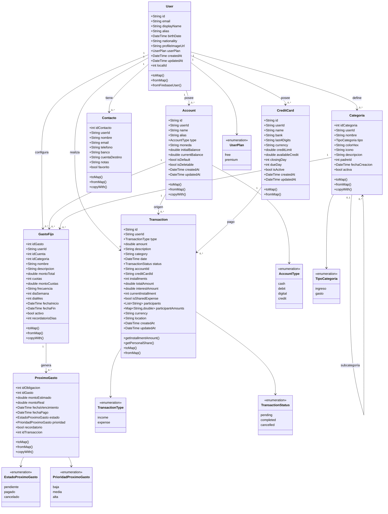
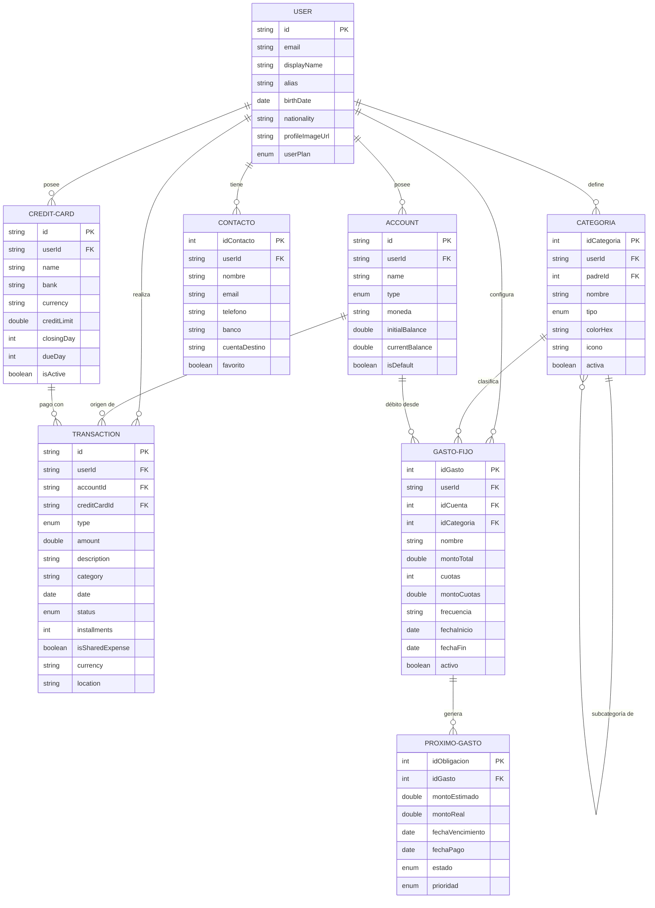

# Modelo de Datos UML - Posición App

## Diagrama de Clases

## Diagrama Entidad-Relación Simplificado

## Notas sobre el Modelo

### Claves Principales
- **User.id**: Firebase UID (String)
- **Account.id**: UUID generado
- **Transaction.id**: UUID generado
- **Categoria.idCategoria**: Autoincremental (int)
- **GastoFijo.idGasto**: Autoincremental (int)

### Relaciones Importantes

1. **User → Account (1:N)**
   - Un usuario puede tener múltiples cuentas
   - Una cuenta pertenece a un solo usuario
   - Relación identificada por `Account.userId`

2. **Account → Transaction (1:N)**
   - Una cuenta puede tener múltiples transacciones
   - Una transacción puede asociarse a una cuenta O a una tarjeta de crédito
   - Relación identificada por `Transaction.accountId` o `Transaction.creditCardId`

3. **GastoFijo → ProximoGasto (1:N)**
   - Un gasto fijo genera múltiples próximos gastos
   - Relación identificada por `ProximoGasto.idGasto`

4. **Categoria → Categoria (Recursiva)**
   - Una categoría puede tener subcategorías
   - Relación identificada por `Categoria.padreId`

5. **Transaction → Participants (N:M)**
   - Una transacción puede tener múltiples participantes
   - Implementado con `isSharedExpense`, `participants` y `participantAmounts`

### Características Especiales

- **Multi-moneda**: Account y Transaction soportan múltiples monedas (ARS, USD, EUR)
- **Cuotas**: Transaction soporta pagos en cuotas con intereses
- **Geolocalización**: Transaction puede guardar ubicación GPS
- **Gastos compartidos**: Transaction soporta división de gastos entre usuarios
- **Recordatorios**: GastoFijo y ProximoGasto incluyen sistema de recordatorios
- **Soft Delete**: Muchas entidades usan campos `activa` en lugar de borrado físico

### Enumeraciones

- **AccountType**: cash, debit, digital, credit
- **TransactionType**: income, expense
- **TransactionStatus**: pending, completed, cancelled
- **TipoCategoria**: ingreso, gasto
- **EstadoProximoGasto**: pendiente, pagado, cancelado
- **PrioridadProximoGasto**: baja, media, alta
- **UserPlan**: free, premium
